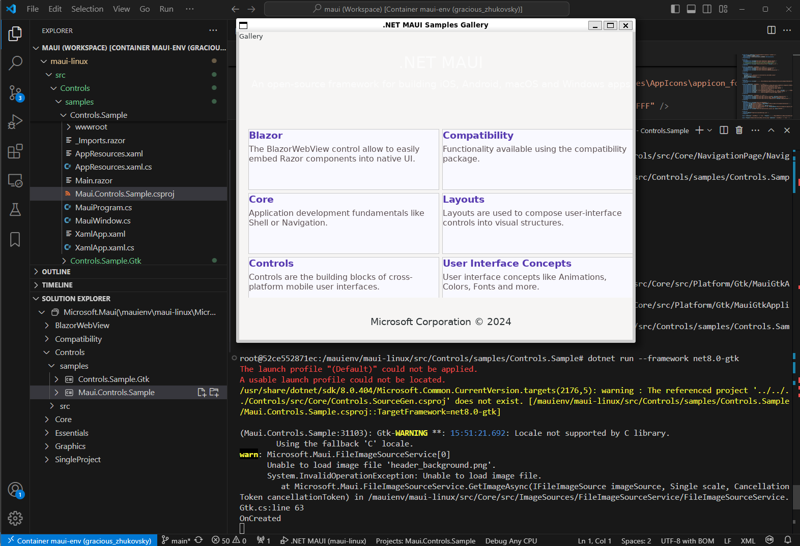
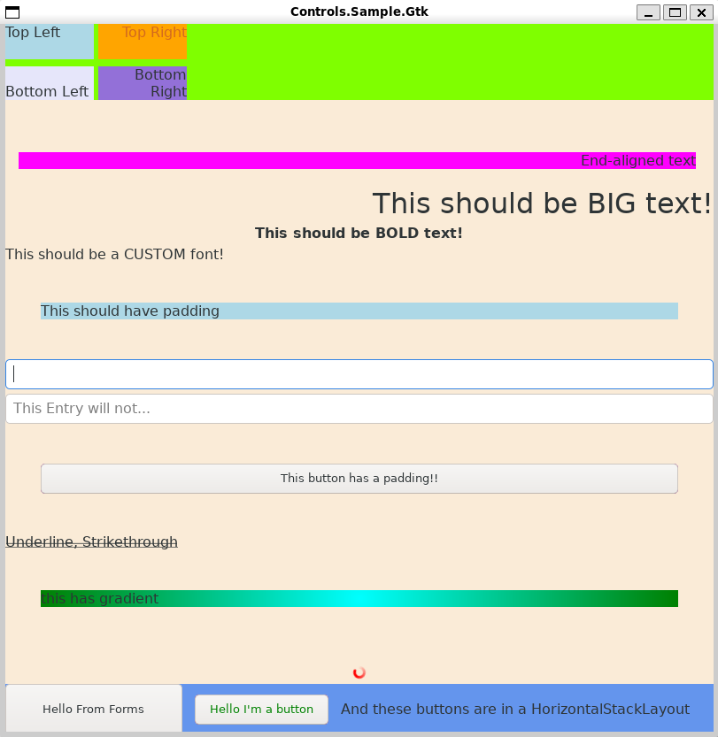

# maui-podman -- a Podman container for reproducably setting up a MAUI development environment

This is currendly only intended to demonstrate issues with the [MAUI](https://github.com/lytico/maui) Gtk platform and not 
for active development as changes in the container would get lost on a `podman build`. I'm working on a devcontainer setup to have the maui folder mounted as a podman volume to persist changes to the codebase.

<!--
Note: You need to have [Podman](https://podman.io/docs/installation) installed and set up 
on your system to use this.
-->

After git-cloning and cd into the repo, build the image:

```sh
sudo podman build -t maui-env .
```

This will build MAUI along with GtkSharp already. Then start the container (which can take a minute) using:

```sh
xhost +  # allow container to use the X display of the host
podman run -it --rm -e DISPLAY=$DISPLAY -v /tmp/.X11-unix:/tmp/.X11-unix maui-env bash
xhost -  # restrict display access again
```

Alternatively, use Visual Studio Code to handle the display and have a deeper look at the MAUI sources:
* Start VS Code in a new bash outside the container with `code .`,
* then install VS Codes 'Dev Containers' and 'Docker' extension. After that, 
* in the 'Containers' item of side panel start the 'maui-env' container and right click / attach it to VS Code, 
* then click the generated container name at the top. 
* In the newly opened Code window, wait a few seconds until VS Code is setup in the container.

Finally open folder /mauienv/maui-linux/ and enter these commands in VS Codes terminal window:

```sh
cd /mauienv/maui-linux/src/Controls/samples/Controls.Sample
dotnet run --framework net8.0-gtk
```



Also have a look at

```sh
cd ../Controls.Sample.Gtk
cp ../Controls.Sample/Resources/Images/calculator.png ./dotnet_bot.png  # someone forgot to git add the image
dotnet run
```


